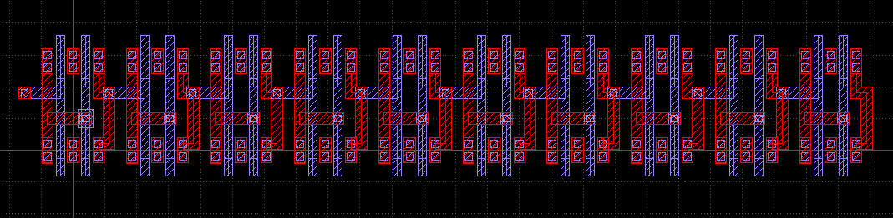
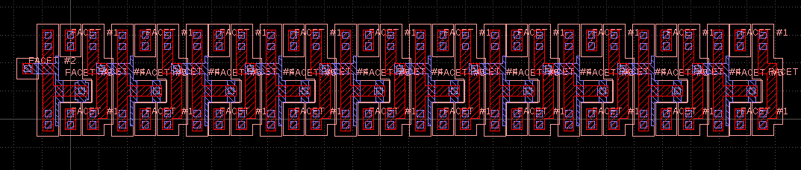
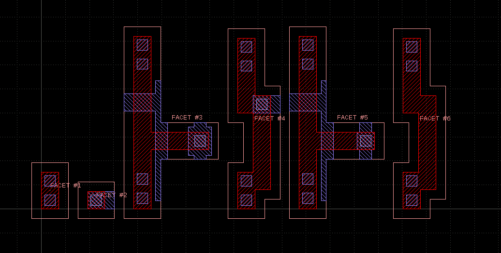

# A Layout Deconstruction Prototyping Framework

The "facets" library a simple Python-based framework utilizing
KLayout's Python API or the klayout PyPI module to separate a layout
into "useful" parts, do something with them, and re-integrate the 
results.

*NOTE*: this library requires Python 3!

The concept is this:

Given is a layout in the form of a GDS file, with a variety of
layers and potentially a hierarchy below a single top cell.

Inside this layout, "interesting" parts are defined by polygons
on a "seed" layer, which is one of the layout layers. Polygons
are always merged before using them as seeds, so each seed is 
an isolated island, originally maybe composed of several connected
polygons.

For each seed there is a "halo" which is a fixed distance around
the seed polygon. A number of "side layers" can be specified.
For each seed polygon, the polygons from these side layers are
collected when being within the range of the halo and are 
clipped to the oversized seed polygon. So everything within the
on the side layers and within halo distance of the seed polygon
is collected.

Seed polygon, halo mask and the polygons from the side layer form
a "facet". Facets are normalized with respect to their origin and
reused - this already implies a certain, coarse level of pattern
recognition. A single facet is used multiple times if applicable.

After the facets are formed, the facets can be processed.

Each facet if then visited and presented to the "operator": this
is a custom class which can investigate the facet with the seed
and the side layer polygons. When the operator computes something,
it can store the results in a generic "result" attribute of the
facet. Each facet is only visited once, so the operator typically
gets less to do than for the full layout.

The final step then is "integration". In the integration step,
all facets with the positions are handed of to the integrator 
object. This is a custom class which recieves each facet and
a list of the original facet's positions.


## Modules, classes

The central class is the "Separator" class:

```
from facets import Separator
```

The Separator is initialized with a layout object, information about
the seed and side layers and the top cell. In addition the halo distance
can be specified.


## Example

The following example deconstructs one seed layer
of an input layout, collects the attached polygons from three 
different layers and reconstructs the original seed layer
fogether with all side layer polygons in the vicinity of the
seed polygons.

In addition, the facets are annotated with a polygon indicating
the mask, a serial number label and a facet gallery is produced.

The code is found in "samples/separate_and_regenerate/".

The first part is the initialization which sets up a KLayout
layout object, reads a file and gets the layer indexes of 
the involved layers. The seed layer is GDS layer 6, Layers 3 to 5
are the side layers:

```
ly = Layout()
ly.read("sample.gds")

l3 = ly.layer(3, 0)
l4 = ly.layer(4, 0)
l5 = ly.layer(5, 0)
l6 = ly.layer(6, 0)
```

With this layout we initialized and feed a Separator object. Note that the
halo is given in database units. As the sample layout has a database unit
of 1nm, the halo is 200nm:


```
halo = 200

sep = facets.Separator(layout = ly, seed_layer = l6, side_layers = [ l3, l4, l5 ], halo = halo)
```

In the next step we'll process the facets. For this we need an operator object.
It will generate the serial numbers and create a text object for it.
This serial number text object is kept in the facet's "result" attribute
which is generic and can hold any Python object. "Text" is KLayout's
object for a label. The label is put at the center of the seed polygon's
bounding box:


```
class SampleOperator(object):

  """
  This sample operator creates a text to label the facet with 
  an index.
  """

  def __init__(self):
    self.facet_index = 0

  def do(self, facet):

    self.facet_index += 1

    # create a text with the facet index and store in the facet's
    # generic result value
    p = facet.seed.bbox().center()
    facet.result = Text("FACET #" + str(self.facet_index), p.x, p.y)

```

With this operator we can run the processing step on the separator:

```
# Process the facets - assigns texts
sep.process(SampleOperator())
```

Finally, we'll reintegrate the facets to regenerate the original layer 6/0
and the parts of layers 3 to 5 which are within the halo range of polygons
on layer 6/0.

The integrator object class is shown below. It takes an empty layout
object. First it adds the required layers. Layer 0/0 is a new layer
used to output the mask polygon (seed polygon oversized by halo) and
the serial number label. 

The new top cell is "TOP". "ALL_FACETS" will become a gallery of all
facets present.

The actual "integrate" method will feed the facets into the new top 
cell using their original locations - this will regenerate the layout.
Each facet gets it's own new cell for simplifying this task.

In addition, each facet is added once to the "ALL_FACETS" cell 
starting from the left and adding new facets on the right with 
a small distance:


```
class SampleIntegrator(object):

  def __init__(self, layout):

    self.layout = layout
    self.l3 = layout.layer(3, 0)
    self.l4 = layout.layer(4, 0)
    self.l5 = layout.layer(5, 0)
    self.l6 = layout.layer(6, 0)

    # this is where the texts go
    self.l0 = layout.layer(0, 0)

    self.top_cell = layout.create_cell("TOP")
    self.all_facets_cell = self.layout.create_cell("ALL_FACETS")
    self.facet_x = 0

  def integrate(self, facet, offsets):

    # Creates one cell per facet and places it where the original locations 
    # have been found. Copies layout, side layout and generated texts 
    # to the facet cell.
    # 
    # This code will also place all different facets into the second
    # "ALL_FACETS" top cell.

    facet_cell = self.layout.create_cell("FACET")

    facet_cell.shapes(self.l0).insert(facet.result)
    facet_cell.shapes(self.l0).insert(facet.mask)

    facet_cell.shapes(self.l6).insert(facet.seed)
    for l, i in [(self.l3, 0), (self.l4, 1), (self.l5, 2)]:
      facet_cell.shapes(l).insert(facet.side_regions[i])

    for o in offsets:
      self.top_cell.insert(CellInstArray(facet_cell.cell_index(), Trans(o.x, o.y)))

    self.all_facets_cell.insert(CellInstArray(facet_cell.cell_index(), Trans(self.facet_x, 0)))
    self.facet_x += facet.mask.bbox().width() + 200
```

The following images show the original layout, the re-generated layout and the 
facet gallery:





  
## Outlook

The scope of this library isn't performance. It's a prototyping or demonstration platform.

However, the sketched concept is also available inside KLayout as an efficient and even hierarchical
and multi-threaded engine. If the concept prooves to be useful, it will be feasible to incorporate
an equivalent interface into the C++ API with a much better performance.

This will allow porting the applications to native code finally.

